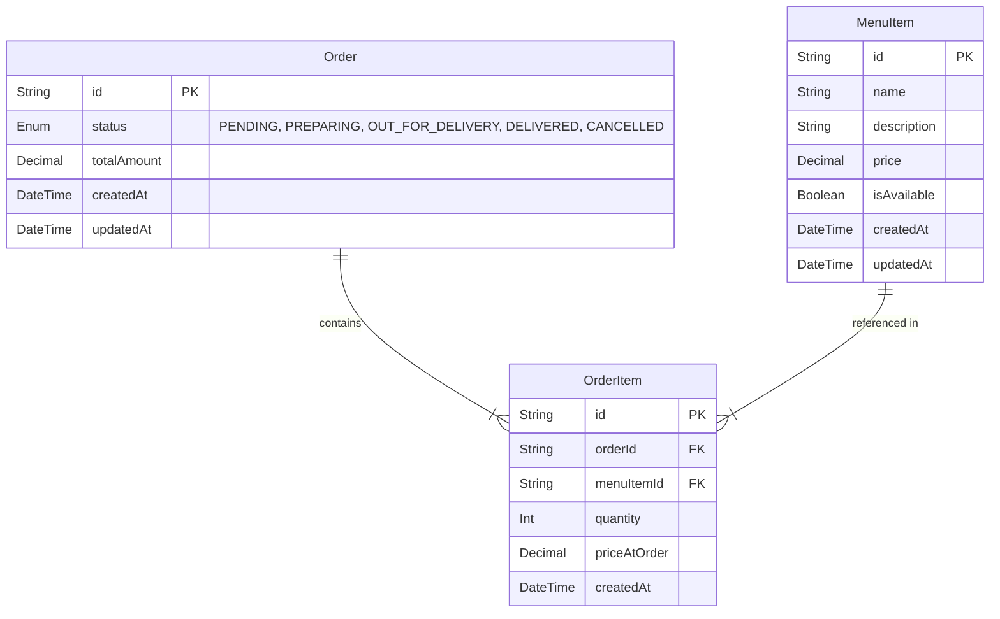

# Database Design

## 1. Entity-Relationship (ER) Diagram

## 2. Table Schemas

### `MenuItem`
Stores the catalog of available food items.

### `Order`
Represents a customer's order and its current status.

### `OrderItem`
A junction table that connects an Order to MenuItems, including quantity and snapshot pricing.

## 3. Data Types and Constraints

- `id`: UUID (v4) for globally unique identifiers, obscuring creation order and volume.
- `status`: PostgreSQL `ENUM` type ensuring data integrity.
- `price`, `totalAmount`, `priceAtOrder`: `DECIMAL(10, 2)` to accurately represent currency and avoid floating-point precision issues.

## 4. Price Snapshot Explanation

The `OrderItem` table contains a `priceAtOrder` column. When an order is placed, the current price of the `MenuItem` is copied into `priceAtOrder`. 
**Why?** If the price of a menu item changes tomorrow, historical orders must reflect the price the customer actually paid at the time, not the new price.

## 5. Index Strategy

- **Primary Keys:** Automatically indexed by PostgreSQL.
- **Foreign Keys:** Indexes on `OrderItem.orderId` and `OrderItem.menuItemId` to speed up relational queries (e.g., fetching all items for an order).
- **Status:** Index on `Order.status` if frequent filtering by status (e.g., active orders dashboard) is required.

## 6. Money Representation (Decimal 10,2)

Floating point numbers (`FLOAT`, `DOUBLE`) can cause precision errors in financial calculations (e.g., `0.1 + 0.2 = 0.30000000000000004`). We use `DECIMAL(10,2)` (via Prisma's `Decimal` type) to ensure exact representation of currency.

## 7. Migration Strategy

- **Schema First:** Changes are made in `schema.prisma`.
- **Prisma Migrate:** `npx prisma migrate dev` generates versioned SQL migration files.
- **CI/CD:** In production, `npx prisma migrate deploy` applies pending migrations without dropping data.
