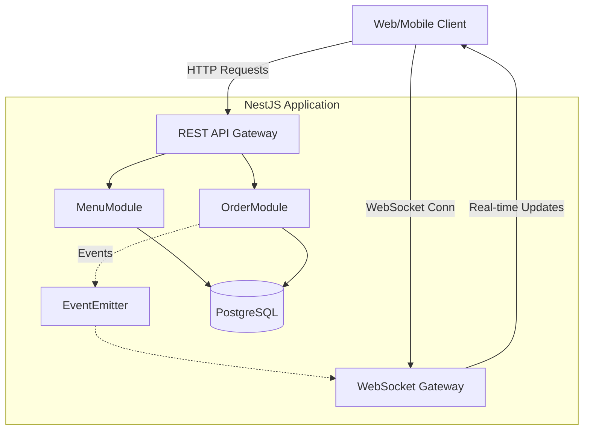
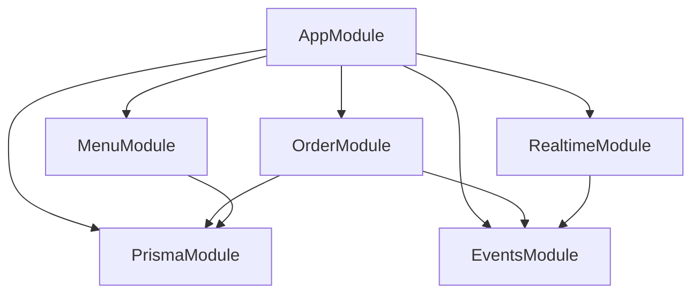
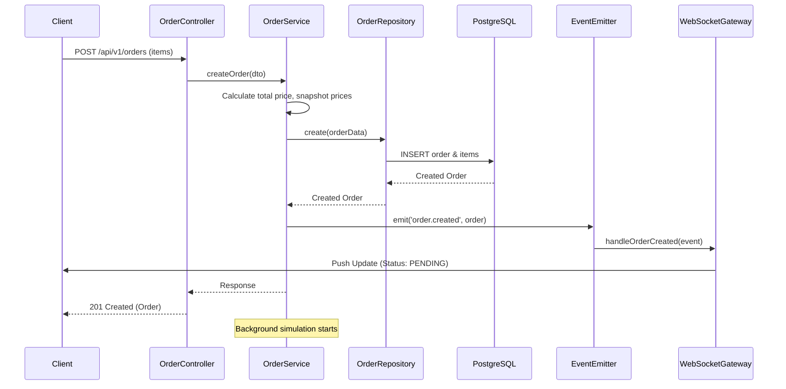
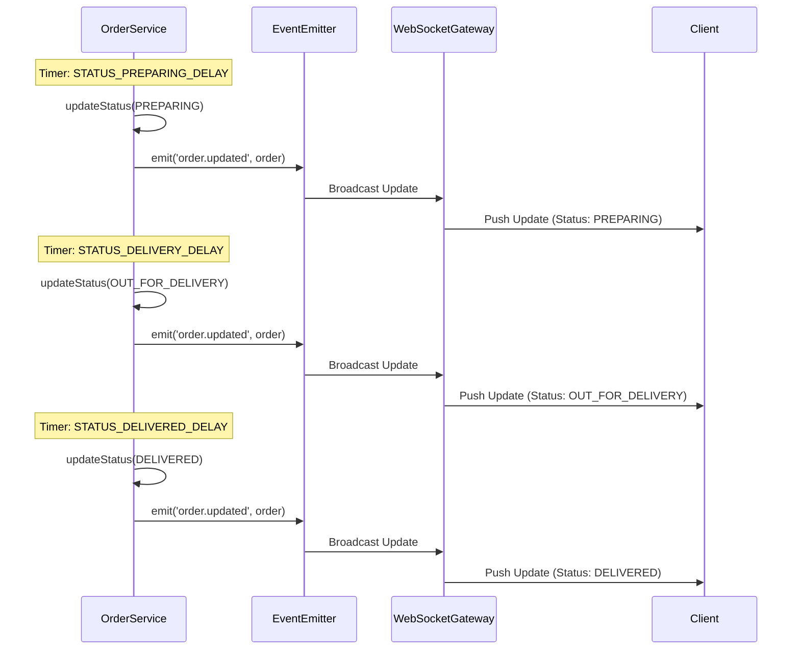
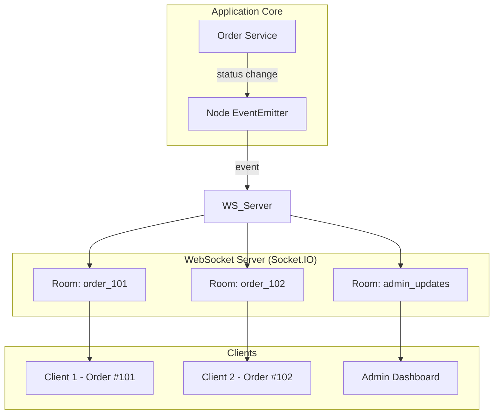

# High-Level Design (HLD)

## 1. System Overview

The Order Management Backend is a robust, modular API designed for handling food delivery orders. It provides a RESTful interface for managing menus and orders, coupled with a real-time WebSocket layer to push status updates to clients. The system is built using NestJS, TypeScript, and PostgreSQL (via Prisma ORM), enforcing strict business rules and clean architecture principles.

## 2. Architecture Diagram

## 3. Module Architecture Diagram

## 4. Order Creation Sequence Diagram

## 5. Status Simulation Sequence Diagram

## 6. Real-time Architecture Diagram

## 7. Technology Choices Rationale

- **NestJS:** Chosen for its opinionated, modular structure, excellent dependency injection, and native TypeScript support. It scales well with team size and codebase complexity.
- **TypeScript:** Enforces type safety, catching errors at compile-time rather than runtime.
- **PostgreSQL:** A highly reliable, ACID-compliant relational database. Perfect for transactional financial data (orders, prices).
- **Prisma:** Provides a type-safe database client and straightforward schema migrations.
- **Socket.IO:** Offers reliable real-time bidirectional communication with automatic fallbacks and built-in room support.

## 8. Scalability Approach

The current design is a **Modular Monolith**. This is the right choice for early-stage applications as it provides clear boundaries without the operational overhead of microservices. 
- **Database:** PostgreSQL handles high concurrency. Indexes are placed strategically on foreign keys and queried fields.
- **Compute:** The NestJS app is stateless (except for WebSocket connections and in-memory timers) and can be scaled horizontally.

## 9. Production Evolution Path

To take this application to production scale:
1.  **State Management:** Replace in-process `EventEmitter` with a durable message broker (RabbitMQ or Kafka) for cross-service events.
2.  **WebSocket Scaling:** Introduce a Redis adapter for Socket.IO to broadcast events across multiple instances.
3.  **Background Jobs:** Replace in-memory `setTimeout` with a robust background job queue (e.g., BullMQ with Redis) to ensure state transitions happen reliably even if the pod restarts.
4.  **Database:** Introduce read-replicas if read traffic (menu fetching, order history) overwhelms the primary database.

## 10. In-process Timer Limitations and Production Alternatives

**Current Limitation:** The automated status progression uses Node.js `setTimeout`. If the application crashes or restarts, active timers are lost, and orders will stall in their current state.

**Production Alternative:** 
- Use a distributed job queue like **BullMQ**.
- When an order is created, schedule a delayed job for `PREPARING`, which schedules a job for `OUT_FOR_DELIVERY`, etc.
- This ensures persistence, retry logic, and horizontal scalability.
