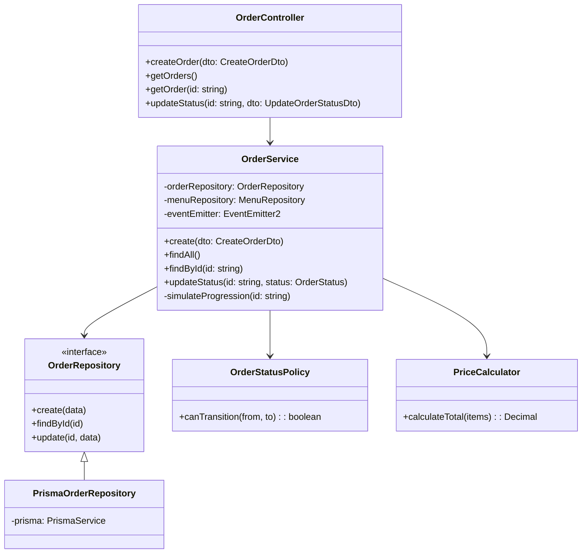

# Low-Level Design (LLD)

## 1. Module Responsibilities

- **AppModule:** The root module coordinating configuration, database, events, and sub-modules.
- **MenuModule:** Manages `MenuItem` operations. Encapsulates the controller, service, and repository.
- **OrderModule:** Core business logic for handling orders, state transitions, and background progression.
- **RealtimeModule:** Manages WebSocket connections and relays domain events to connected clients.
- **PrismaModule:** Global module providing a singleton `PrismaService` for database access.

## 2. Class Diagram

## 3. Controller → Service → Repository Layering

- **Controller Layer:** Handles HTTP requests, input validation (via pipes), and maps DTOs to service calls. Does not contain business logic.
- **Service Layer:** Contains core business logic, orchestrates data retrieval/storage, enforces domain rules (e.g., status transitions), and emits domain events.
- **Repository Layer:** Abstracts database access. Interfaces are used for dependency injection to allow mocking in tests or swapping the ORM.

## 4. Domain Classes

- **OrderStatusPolicy:** Encapsulates the state machine logic for order statuses. Prevents invalid transitions (e.g., `DELIVERED` -> `PREPARING`).
- **PriceCalculator:** Pure functions or classes responsible for calculating order totals, handling duplicate item merging, and applying taxes/discounts (if added later).

## 5. DTOs Catalog

- `CreateOrderDto`: Contains array of `OrderItemDto`.
- `OrderItemDto`: `menuItemId`, `quantity`.
- `UpdateOrderStatusDto`: `status` (Enum).
- `OrderResponseDto`: Formatted output hiding sensitive DB fields, mapping Decimal types to numbers/strings.

## 6. Event System Design

- Uses `@nestjs/event-emitter`.
- Events:
  - `order.created`: Triggered after order insertion. Payload: Order object.
  - `order.updated`: Triggered on status change. Payload: Order object.
- **Decoupling:** The `OrderService` emits events without knowing about WebSockets. The `RealtimeModule` listens to these events and handles socket communication.

## 7. WebSocket Gateway Design

- **Namespace/Path:** `/events` or default.
- **Rooms:** Clients join rooms named `order_${orderId}` to receive updates only for their orders.
- **Events Emitted:**
  - `orderStatusUpdate`: Sent to specific order rooms.
  - `newOrder`: Sent to admin rooms.

## 8. Error Handling Hierarchy

- Global `ExceptionFilter` (e.g., `HttpExceptionFilter`, `PrismaClientExceptionFilter`) catches unhandled exceptions.
- Domain exceptions (e.g., `InvalidStatusTransitionException`, `MenuNotFoundException`) extend NestJS's `BadRequestException` or `NotFoundException` for automatic correct HTTP status codes.
